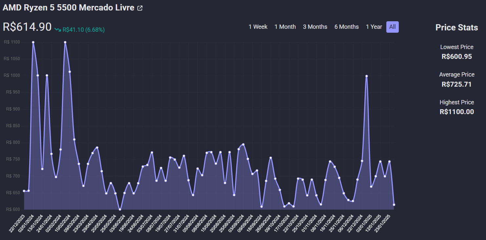

# Price Tracker

> Acompanhe o histórico de preços dos produtos cadastrados.

## Ajustes e melhorias

O projeto ainda está em desenvolvimento e planejo adicionar as seguintes features:

- [ ] Página inicial
- [ ] Favoritar produtos
- [ ] Filtrar o período de visualização do histórico de preços
- [ ] Paginação
